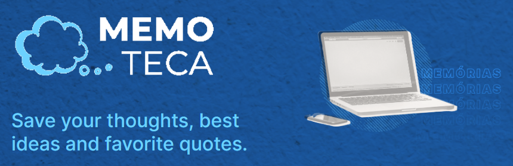
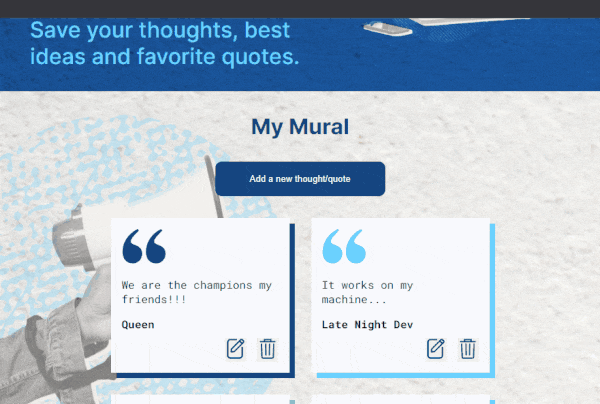
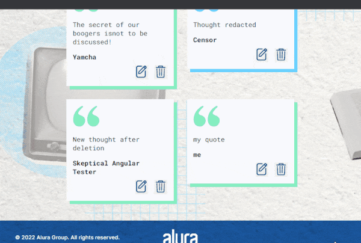
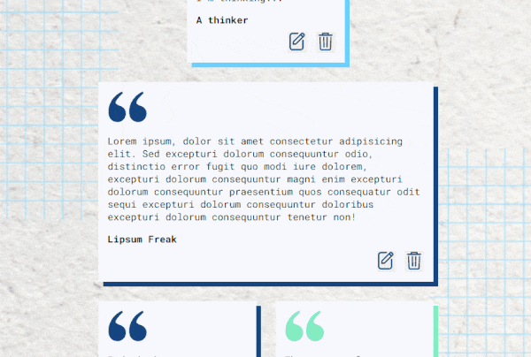

# MemoTeca 💭 Learning Angular 17 and NodeJs




## Project Details
This project was developed to grasp the fundamentals of Angular 14. It consists of two pages: one for creating thoughts/quotes and another for listing, editing, and deleting saved thoughts/quotes. Data is stored in a local Api Server.

##### Page overview


##### Adding a new item


##### Editing an item


##### Deleting an item


## How to run this project

This project was generated with Angular CLI version 17.0.0. The local server uses a NodeJs API.

If you don't have Angular CLI installed, run the following command in a terminal:

```bash
npm install -g @angular/cli
```

After cloning/downloading the code, open a terminal, go to the project's root folder, and run the following command to install all necessary dependencies:

```npm install```

Next, go to the backend folder and run the following command to install backend dependencies:

```bash
cd Back
npm install
```

Development server
You'll need to keep two terminals open, one for the  server and another for the development server (where the application will run).

In the first terminal, go to the backend folder and start the API using the following command. The server will use port 3000 to run.

```npm run dev```

In the second terminal, go to the project's front/Memoteca-app folder and run the following command. Navigate to http://localhost:4200/ to open the app. The app will automatically reload if you change any of the source files.

```ng serve```

Further help
To get more help on the Angular CLI, use or go check out the Angular CLI Overview and Command Reference page.
